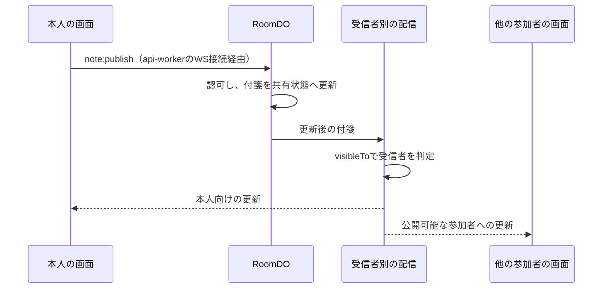
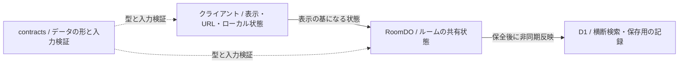
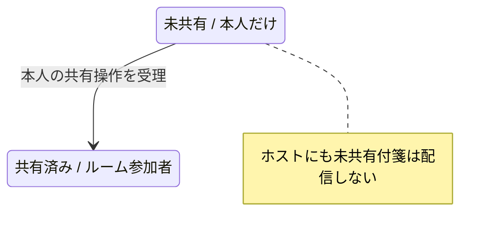
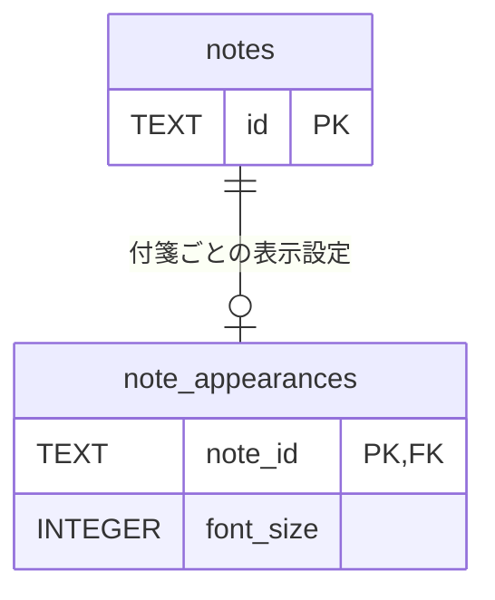

# コンセプト図とDB変更の具体例

図を載せるPRで使う。以下は既存仕様を題材にした例で、今回の差分を説明する図の代わりではない。
構成は[PRテンプレート](../../../../.github/pull_request_template.md)、
現在の責務は[構成概要](../../../../docs/architecture/overview.md)を参照する。

## 図を選ぶ

| 読み手が知りたいこと                       | 選ぶ図                 | このアプリでの題材                                      |
| ------------------------------------------ | ---------------------- | ------------------------------------------------------- |
| 操作がいつ受理され、どこへ届くか           | 処理順（シーケンス図） | 付箋共有、参加者の除外、再接続                          |
| どの層が何を持ち、どこで判定するか         | 責務（関係図）         | UI・Server Action・api-worker・RoomDO、RoomDOとD1の分担 |
| どの条件で状態・操作可否・公開先が変わるか | 状態（状態遷移図）     | 個人ワークから共有、投票、退出後の成果閲覧              |

差分の主な争点に合う図を1つ選ぶ。例えば、配信順序を処理順で示しても公開先の違いが分からなければ、
状態図や受信者別の小さな表を補う。文言・余白・小さな文書修正などは、文章や画面資料で仕組みが分かれば図を省略する。

図には実際の操作、境界、保存先、受信者を使う。今回変わる箇所をラベルや注記で示し、
変更に関係しないクラスや全機能を並べない。認可・配信の詳細は
[共有状態と認可](../../../../docs/development/conventions.md#共有状態と認可)を確認する。

## 1. 処理順：付箋の共有が他の参加者へ届く

共有操作の主な受理・配信経路を抜粋した例。接続時の認証や失敗経路を変更するPRでは、それらも描く。

例の根拠：[付箋の操作](../../../../workers/room/note-handlers.ts)、
[受信者別の配信](../../../../workers/room/broadcast.ts)、
[可視性](../../../../workers/visibility.ts)。

## 2. 責務：ルームの状態と保存用の記録を分ける

状態の持ち場所に着目した例。矢印はデータへの依存や保存後の反映を表し、全通信経路を列挙していない。
Server ActionやAPIの境界が変更点なら、それらを展開する。

RoomDOが操作可否と最新の共有状態を持ち、D1はルーム横断の索引や保存用の記録を持つ。
`contracts`はデータの形を定めるが、認可や永続化を担当しない。
例の根拠：[現在の構成とデータ責務](../../../../docs/architecture/overview.md)。

## 3. 状態：共有前後の公開先を示す

公開先の変化だけを抜粋した例。共有の取り消しや操作可能な工程を変更するPRでは、その遷移と条件も追加する。

状態だけでは役割の違いを表しにくい場合は、誰が操作できるか・何を受信できるかを表で補う。
非メンバーへの配信を許可する図にしない。
例の根拠：[可視性](../../../../workers/visibility.ts)、
[進行要求](../../../../docs/prd.md#6-mvp-デザインスプリントフロー)。

## DB変更：3種類の図に加えて書く

DBの構造・データの変更があるPRでは、上のどの図を選んでも「DBの変更」を追加する。
図が不要なDB変更でも、スキーマの差分とデータへの影響は文章や表で示す。

- 対象：D1 / RoomDO、対象のテーブル・カラム・制約・索引。
- 差分：変更前と変更後、既存行の扱い、初期値・補完・データ変換。
- 移行：該当するmigrationへのリンク、適用順、破壊的変更の有無と復旧時の注意点。
- 資料：関係が変わるならER図、カラム・制約・索引だけなら差分表。生成済みの
  `Schema/SchemaDiagram`・`Schema/SchemaDetails`があれば利用し、関係する資料へ案内する。

適用後の読み書きや既存データの保持は、動作確認手順の要件として確認条件・手順・結果を記載する。
DB検査やmigrationの扱いは[開発規約のMigration](../../../../docs/development/conventions.md#migration)に従う。
D1とRoomDOは別のDBなので、両者を外部キーで結んだER図を作らない。

### 例：RoomDOに付箋ごとの文字サイズを保存する

[既存migration](../../../../workers/room-do-migrations/20260922114121-add-note-font-size.sql)を題材にした記述例。
新しいテーブルを足す場合は関係図、既存データへの影響は短い表にする。

| 観点         | 変更前                 | 変更後                                                   |
| ------------ | ---------------------- | -------------------------------------------------------- |
| 保存先       | `note_appearances`なし | RoomDOに`note_appearances`を追加                         |
| 付箋との関係 | なし                   | `note_id`を主キー・外部キーとし、付箋削除時は設定も削除  |
| 文字サイズ   | 個別設定の保存なし     | `font_size`は整数12〜24、NOT NULL、DEFAULT 14            |
| 既存データ   | 既存の付箋             | 付箋行を保持。設定行がない付箋はアプリ側で14pxとして補完 |

設定行の追加はmigrationで既存付箋ごとに行うのではなく、行がない場合の読み取りで補完する。
これはSQLのDEFAULTだけでは説明できないため、既存データの扱いに明記する。
復旧でこの表を削除すると保存済みの個別設定を失う。マージ済みのRoomDO migrationを編集して戻さず、
必要な変更は新しいmigrationで行う。
