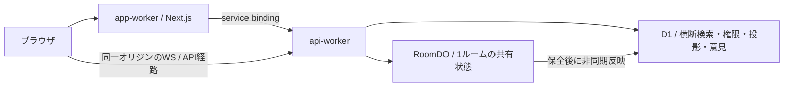

# 現在の構成とデータ責務

本番はNext.js / OpenNextのapp-workerと、D1 / RoomDOへの入口であるapi-workerの2 Worker構成。採用理由は[ADR 0001](../adr/0001-cloudflare-room-authority.md)、実装規約は[開発規約](../development/conventions.md)、提供する振る舞いは[PRD](../prd.md)と[進行仕様](../product/sprint-flow.md)。

## 境界

UI / Server Actions / api-worker / RoomDOの境界を保つ。ブラウザにセッション秘密や特権アクセスを置かず、境界のデータ形は`contracts/`に定義する。Next側のデータ取得は`lib/api-client.ts`、Workerの入口は`workers/api-worker.ts`。Google OIDCでログインし、HS256 JWT Cookieのセッションを各保護境界で検証する。

## どこが真実を持つか

| 場所         | 持つもの                                                                                                     | 持たせないもの                     |
| ------------ | ------------------------------------------------------------------------------------------------------------ | ---------------------------------- |
| RoomDO       | メンバー・ホスト・付箋・進行・票・グループ・操作権・成果保全・進行記録・完了時の在籍者と固定期限・再試行情報 | 他ルームの横断検索                 |
| D1           | ユーザー・招待コードからルームの解決・ユーザー権限・共有成果と進行記録の投影・完了ルームの索引・意見         | ルーム内の操作を受理する第二の権威 |
| contracts    | WS / REST / セッションの形・入力検証・共通定数                                                               | 認可そのもの、永続化、実行時の真実 |
| クライアント | サーバー状態の畳み込み・URL・ローカルUI状態                                                                  | 他者の未共有付箋や投票中の個別票   |

## 保全と読み取り

操作の可否と可視性はRoomDOで判定し、`workers/visibility.ts`を通して受信者別に配信する。D1の投影はルーム横断の閲覧用で、失敗時はRoomDOで保全した内容から再試行する。完了時の成果と本人向け再訪権は同じ更新単位で固定する。

未完了の成果は最後の利用から30日、本人向け再訪対象の完了ルームは初回完了から30日。意見は初回受信から30日で、別権限と別期限を持つ。取得時にも期限を拒否し、削除の成功を待って閲覧許可することはない。閲覧や再試行で保持期限を延長しない。

実行手順と失敗時の確認は[共有成果](../operations/shared-outcomes.md)、[意見](../operations/feedback.md)、[権限付与](../operations/access.md)へ分ける。

## コード・設定から確認する

- 配信とバインディング：[app設定](../../wrangler.jsonc)、[API設定](../../workers/wrangler.jsonc)、[API転送](../../workers/app-worker.ts)
- ルームの入口：[RoomDO](../../workers/room/room-do.ts)、[進行](../../workers/room/phase.ts)、[可視性](../../workers/visibility.ts)
- 保存と投影：[成果保全](../../workers/room/shared-outcome-storage.ts)、[進行記録](../../workers/room/progress-history.ts)、[完了ルーム](../../workers/room/completed-rooms.ts)
- スキーマ：[D1 migrations](../../workers/migrations/)、[RoomDO migrations](../../workers/room-do-migrations/)。現在の図はStorybookの`Schema/*`を生成して確認する
- 依存：Storybookの`Dependencies/*`。手書きの変動するfeature一覧を正本にしない
- 公開：[リリース運用](../operations/release.md)、[Deploy workflow](../../.github/workflows/deploy.yml)

図による解説は[構成](../site/architecture/index.html)・[データ責務](../site/data-ownership/index.html)・[Cloudflare](../site/cloudflare-map/index.html)。`site/deploy-map/system.puml`は採用時の図の編集資料として保持し、現行構成図を別々に手動更新する正本にはしない。
