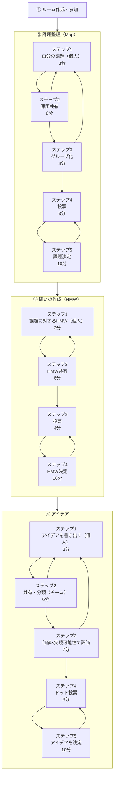

# デザインスプリント フェーズ・ステップ別 機能対応表

各フェーズのステップと、そのステップで有効になる機能の対応関係を一覧化したもの。
全体のステップ構成の唯一の真実であり、各ステップの目的・ガイド文言は
[`dezain-supurinto.md`](./dezain-supurinto.md) を参照。

## 全体像

## 同じフェーズ内での繰り返し

基本ルートとステップ数（5・4・5）は維持する。3フェーズ・現在ステップ・ゴールは左上に常時表示し、全手順は初期折りたたみの「全手順を見る／閉じる」で確認する。Issue #324の基本ルート常時表示案は、UI合意によりこの開閉方式へ変更した。

- 共有（全フェーズのStep2）と1-3・3-3では、ホストが下中央の「もう一度付箋を書く」から確認し、全員で同フェーズのStep1へ戻れる。通常の前進は右上に置く。
- 決定（1-5・2-4・3-5）では、採用前に「もう一度投票する」「採用する付箋を選ぶ」を下中央に置く。候補の移動は全参加者、除外・復帰と採用はホストのみ。移動で本文・票・グループ・候補状態を変えず、候補外は復帰まで移動できない。投票中と採用確定後は移動・候補整理を止める。
- 再投票は候補件数と「付箋は消えません」を確認し、開始時だけ当該フェーズの前回票（候補外を含む）を削除する。主観1票・客観3票、投票完了状態をリセットする。候補状態・配置は保持し、投票中は本人の今回票だけ、終了時は今回の結果だけを自動表示する。キャンセル時は全保持し、履歴は保存しない。
- 候補0件は投票・採用・次へ不可。ホストへ復帰方法、参加者へ待機を示す。1件は再投票なしで採用できる。ホストが採用する付箋を選ぶと確認ダイアログなしで決定し、決定後のみ右上から次フェーズへ進む。3-5の確定後は全員に完了を示す。
- 両ループの回数制限はなく、タイマーは遷移で停止して目安時間から手動開始する。配置・パン・ズームはループでリセットせず、説明を強制再表示しない。主要な進行・決定操作は同時最大2つ。決定から個人・共有・整理・評価へ戻る操作、過去フェーズ移動、確定取消は設けない。

## 凡例

| 記号 | 意味                                                 |
| ---- | ---------------------------------------------------- |
| ○    | 必須（このステップでは対応・使用しなければならない） |
| △    | 表示はしているが使用は任意（自由に使ってよい）       |
| ×    | 非対応（機能オフ）                                   |

---

## フェーズ1：課題整理（Map）

### ステップ構成

1. 自分の課題（個人）（3分）
2. 課題共有（6分）
3. グループ化（4分）
4. 投票（3分）
5. 課題決定（10分）

### 機能対応表

| Step                  | マイ付箋（執筆） | マイ付箋エリア（表示） | タイマー | 共有ドラッグ＆ドロップ | 付箋の内容編集 | 投票 | 投票結果 | グループ操作 | グループ表示 | 2軸マッピング | 発想支援ツール |
| --------------------- | ---------------- | ---------------------- | -------- | ---------------------- | -------------- | ---- | -------- | ------------ | ------------ | ------------- | -------------- |
| 1. 自分の課題（個人） | ○                | ○                      | ○        | ×                      | ○              | ×    | ×        | ×            | ×            | ×             | ×              |
| 2. 課題共有           | ×                | ○                      | ○        | ○                      | ○              | ×    | ×        | ×            | ×            | ×             | ×              |
| 3. グループ化         | ×                | ×                      | △        | ○                      | ×              | ×    | ×        | ○            | ○            | ×             | ×              |
| 4. 投票               | ×                | ×                      | △        | ×                      | ×              | ○    | ×        | ×            | ○            | ×             | ×              |
| 5. 課題決定           | ×                | ×                      | △        | ×                      | ×              | ×    | ○        | ×            | ○            | ×             | ×              |

### 設計メモ

- 「マイ付箋」は執筆と表示で可否がずれるため2列に分ける。「マイ付箋（執筆）」は
  マイ付箋を新しく書き起こせるか、「マイ付箋エリア（表示）」は画面にマイ付箋の
  領域が出ているか。Step2（課題共有）は新しく書けない（×）が、書き上げた付箋を
  共有ボードへ上げる・戻す操作の起点なのでエリアは必須（○）。
- 同フェーズ内では未共有の下書きを保持する。Step2や整理・評価からStep1へ戻り、共有済み付箋を閲覧しながら追加できる。下書きは本人にのみ見え、再びStep2で本人がドラッグするまで公開しない。次フェーズへの移行または最終フェーズの完了時にRoomDOが当該フェーズの下書きを破棄する。最初の投票開始時に、以降は共有へ戻れず残る下書きがフェーズ終了時に破棄されると確認する。
- Step2（課題共有）では、付箋同士を近づけても自動グルーピングされないようにする。
  自動グルーピングはStep3（グループ化）専用の挙動とする。
- 「付箋の内容編集」はStep1・Step2でのみ許可する。Step1は個人作業中の書き直し、
  Step2は発表中に見つかった誤字脱字の修正を想定したもの。Step2で共有済み
  （shared）の付箋は既存の共同編集仕様（`workers/room/notes.ts` の `canEdit()`）
  により投稿者本人に限らずルームメンバー誰でも修正できる（`note:move` /
  `note:drag` と同じ共同編集モデル）。Step3（グループ化）以降は、グルーピング・
  投票・集計という合意形成に集中させるため付箋の文言そのものを変える操作は
  許可しない。
- 2軸マッピングはフェーズ3（アイデア）専用の機能のため、本フェーズでは全ステップ×。
- 発想支援ツール（SCAMPER等）もフェーズ3専用の機能のため、本フェーズでは全ステップ×。
- 課題整理（Map）のStep1〜5の5段階構成は `dezain-supurinto.md`
  にも反映済み（Step2「課題共有」とStep3「グループ化」に分割）。
  ステップ構成の変更は必ず本表を起点とし、`dezain-supurinto.md` 側を追従させる。
- ステップ単位でのWSメッセージ実装ゲーティング（`isBoardMutation()` の
  拡張対象表）は実装が変わるたびに変更が必要な実装レベルの詳細のため、
  本表ではなく [Discussion #36](https://github.com/engineer-first/idea-boost/discussions/36)
  で管理する。

---

## フェーズ2：問いの作成（HMW）

フェーズ1と異なりグルーピングは行わない。Step2は「共有・分類」ではなく
「HMW共有」のみとする。

### ステップ構成

1. 課題に対するHMW（個人）（3分）
2. HMW共有（6分）
3. 投票（4分）
4. HMW決定（10分）

### 機能対応表

| Step                       | マイ付箋（執筆） | マイ付箋エリア（表示） | タイマー | 共有ドラッグ＆ドロップ | 付箋の内容編集 | 投票 | 投票結果 | グループ操作 | グループ表示 | 2軸マッピング | 発想支援ツール |
| -------------------------- | ---------------- | ---------------------- | -------- | ---------------------- | -------------- | ---- | -------- | ------------ | ------------ | ------------- | -------------- |
| 1. 課題に対するHMW（個人） | ○                | ○                      | ○        | ×                      | ○              | ×    | ×        | ×            | ×            | ×             | ×              |
| 2. HMW共有                 | ×                | ○                      | ○        | ○                      | ○              | ×    | ×        | ×            | ×            | ×             | ×              |
| 3. 投票                    | ×                | ×                      | △        | ×                      | ×              | ○    | ×        | ×            | ×            | ×             | ×              |
| 4. HMW決定                 | ×                | ×                      | △        | ×                      | ×              | ×    | ○        | ×            | ×            | ×             | ×              |

### 設計メモ

- 「付箋の内容編集」の許可範囲・共同編集の考え方はフェーズ1と同じ
  （Step1・Step2のみ許可。詳細はフェーズ1の設計メモを参照）。
- フェーズ2ではグルーピングを行わないため、グループ操作・グループ表示は
  全ステップで×。
- 2軸マッピングもフェーズ3（アイデア）専用の機能のため、本フェーズでは全ステップ×。
- 発想支援ツール（SCAMPER等）もフェーズ3専用の機能のため、本フェーズでは全ステップ×。
- タイマー・投票・投票結果の必須/任意パターンはフェーズ1と同じ考え方を踏襲
  （個人作業・共有は必須。投票・投票結果自体も各ステップで必須〔○〕であり、
  任意〔△〕になるのはタイマーのみで、投票以降はタイマー表示が任意になる）。

---

## フェーズ3：アイデア

旧④アイデア発想（Sketch）と旧⑤アイデア評価・決定（Decide）を1つのフェーズに
統合したもの。グルーピングは行わず、代わりに「価値（上に行くほど高い）×実現可能性（右に行くほど高い）」の2軸マッピングで
位置付けを行う。

### ステップ構成

1. アイデアを書き出す（個人）（3分）
2. 共有・分類（チーム）（6分）
3. 価値×実現可能性で評価（7分）
4. ドット投票（3分）
5. アイデアを決定（10分）

### 機能対応表

| Step                          | マイ付箋（執筆） | マイ付箋エリア（表示） | タイマー | 共有ドラッグ＆ドロップ | 付箋の内容編集 | 投票 | 投票結果 | グループ操作 | グループ表示 | 2軸マッピング | 発想支援ツール |
| ----------------------------- | ---------------- | ---------------------- | -------- | ---------------------- | -------------- | ---- | -------- | ------------ | ------------ | ------------- | -------------- |
| 1. アイデアを書き出す（個人） | ○                | ○                      | ○        | ×                      | ○              | ×    | ×        | ×            | ×            | ×             | ○              |
| 2. 共有・分類（チーム）       | ×                | ○                      | ○        | ○                      | ○              | ×    | ×        | ×            | ×            | ○             | △              |
| 3. 価値×実現可能性で評価      | ×                | ×                      | △        | ○                      | ×              | ×    | ×        | ×            | ×            | ○             | ×              |
| 4. ドット投票                 | ×                | ×                      | △        | ×                      | ×              | ○    | ×        | ×            | ×            | △             | ×              |
| 5. アイデアを決定             | ×                | ×                      | △        | ×                      | ×              | ×    | ○        | ×            | ×            | ○             | ×              |

### 設計メモ

- 「付箋の内容編集」の許可範囲・共同編集の考え方はフェーズ1と同じ
  （Step1・Step2のみ許可。詳細はフェーズ1の設計メモを参照）。
- グルーピング（グループ操作・グループ表示）は行わないため全ステップ×。
  代わりに2軸マッピング（価値×実現可能性）で位置付けを行う。
- Step1へ戻ったときも、共有済みアイデアは2軸マップ上の同じ位置で閲覧できる。初回の下書きだけのStep1ではマップを表示しない。
- 2軸マッピングはStep2（共有・分類）の時点ですでに配置操作が可能（○）。
  Step3でチームの合意のもと位置を確定する（○）。
- Step4（投票）では2軸マッピングは表示のみ（△）。Step5の最終決定前は、全参加者が候補をマップ内で動かして評価位置を見直せる（○）。候補外と最終決定後は移動できない。再投票と結果表示でも位置を保持する。
- 発想支援ツール（オズボーンのチェックリスト・SCAMPER・逆転発想・他業界事例）は
  Step1（アイデアを書き出す）で必須表示（○）。Step2（共有・分類）では、他の人の発表を
  聞きながら参照してよい任意表示（△）として残す。Step3以降は2軸マッピングでの
  合意形成に集中するため非表示（×）にする。
