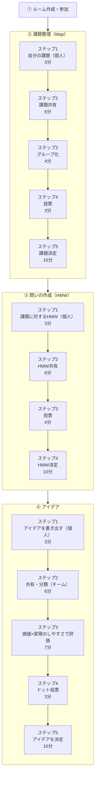

# デザインスプリント フェーズ・ステップ別 機能対応表

各フェーズのステップと、そのステップで有効になる機能の対応関係を一覧化したもの。
全体のステップ構成の唯一の真実であり、各ステップの目的・ガイド文言は
[`dezain-supurinto.md`](./dezain-supurinto.md) を参照。

## 全体像

## 凡例

| 記号 | 意味                                                 |
| ---- | ---------------------------------------------------- |
| ○    | 必須（このステップでは対応・使用しなければならない） |
| △    | 表示はしているが使用は任意（自由に使ってよい）       |
| ×    | 非対応（機能オフ）                                   |

---

## フェーズ1：課題整理（Map）

### ステップ構成

1. 自分の課題（個人）（3分）
2. 課題共有（6分）
3. グループ化（4分）
4. 投票（3分）
5. 課題決定（10分）

### 機能対応表

| Step                  | マイ付箋（執筆） | マイ付箋エリア（表示） | タイマー | 共有ドラッグ＆ドロップ | 付箋の内容編集 | 投票 | 投票結果 | グループ操作 | グループ表示 | 2軸マッピング | 発想支援ツール |
| --------------------- | ---------------- | ---------------------- | -------- | ---------------------- | -------------- | ---- | -------- | ------------ | ------------ | ------------- | -------------- |
| 1. 自分の課題（個人） | ○                | ○                      | ○        | ×                      | ○              | ×    | ×        | ×            | ×            | ×             | ×              |
| 2. 課題共有           | ×                | ○                      | ○        | ○                      | ○              | ×    | ×        | ×            | ×            | ×             | ×              |
| 3. グループ化         | ×                | ×                      | △        | ○                      | ×              | ×    | ×        | ○            | ○            | ×             | ×              |
| 4. 投票               | ×                | ×                      | △        | ×                      | ×              | ○    | ×        | ×            | ○            | ×             | ×              |
| 5. 課題決定           | ×                | ×                      | △        | ×                      | ×              | ×    | ○        | ×            | ○            | ×             | ×              |

### 設計メモ

- 「マイ付箋」は執筆と表示で可否がずれるため2列に分ける。「マイ付箋（執筆）」は
  マイ付箋を新しく書き起こせるか、「マイ付箋エリア（表示）」は画面にマイ付箋の
  領域が出ているか。Step2（課題共有）は新しく書けない（×）が、書き上げた付箋を
  共有ボードへ上げる・戻す操作の起点なのでエリアは必須（○）。
- Step3以降はマイ付箋を共有ボードへ上げる経路が閉じるため、共有されなかった
  マイ付箋は誰の目にも触れない死蔵データになる。エリアを非表示にするだけでなく、
  サーバー（RoomDO）が Step2 → Step3 の遷移時にマイ付箋（`visibility = 'private'`）と
  紐づく `note_votes` を破棄する（`workers/room/phase.ts`）。この一本化により、
  下書きが後続ステップや次フェーズへ持ち越されない。破棄はどのフェーズでも
  「共有ステップ（Step2）を抜けるとき」に起きる。
- Step2（課題共有）では、付箋同士を近づけても自動グルーピングされないようにする。
  自動グルーピングはStep3（グループ化）専用の挙動とする。
- 「付箋の内容編集」はStep1・Step2でのみ許可する。Step1は個人作業中の書き直し、
  Step2は発表中に見つかった誤字脱字の修正を想定したもの。Step2で共有済み
  （shared）の付箋は既存の共同編集仕様（`workers/room/notes.ts` の `canEdit()`）
  により投稿者本人に限らずルームメンバー誰でも修正できる（`note:move` /
  `note:drag` と同じ共同編集モデル）。Step3（グループ化）以降は、グルーピング・
  投票・集計という合意形成に集中させるため付箋の文言そのものを変える操作は
  許可しない。
- 2軸マッピングはフェーズ3（アイデア）専用の機能のため、本フェーズでは全ステップ×。
- 発想支援ツール（SCAMPER等）もフェーズ3専用の機能のため、本フェーズでは全ステップ×。
- 課題整理（Map）のStep1〜5の5段階構成は `dezain-supurinto.md`
  にも反映済み（Step2「課題共有」とStep3「グループ化」に分割）。
  ステップ構成の変更は必ず本表を起点とし、`dezain-supurinto.md` 側を追従させる。
- ステップ単位でのWSメッセージ実装ゲーティング（`isBoardMutation()` の
  拡張対象表）は実装が変わるたびに変更が必要な実装レベルの詳細のため、
  本表ではなく [Discussion #36](https://github.com/engineer-first/idea-flow-app/discussions/36)
  で管理する。

---

## フェーズ2：問いの作成（HMW）

フェーズ1と異なりグルーピングは行わない。Step2は「共有・分類」ではなく
「HMW共有」のみとする。

### ステップ構成

1. 課題に対するHMW（個人）（3分）
2. HMW共有（6分）
3. 投票（4分）
4. HMW決定（10分）

### 機能対応表

| Step                       | マイ付箋（執筆） | マイ付箋エリア（表示） | タイマー | 共有ドラッグ＆ドロップ | 付箋の内容編集 | 投票 | 投票結果 | グループ操作 | グループ表示 | 2軸マッピング | 発想支援ツール |
| -------------------------- | ---------------- | ---------------------- | -------- | ---------------------- | -------------- | ---- | -------- | ------------ | ------------ | ------------- | -------------- |
| 1. 課題に対するHMW（個人） | ○                | ○                      | ○        | ×                      | ○              | ×    | ×        | ×            | ×            | ×             | ×              |
| 2. HMW共有                 | ×                | ○                      | ○        | ○                      | ○              | ×    | ×        | ×            | ×            | ×             | ×              |
| 3. 投票                    | ×                | ×                      | △        | ×                      | ×              | ○    | ×        | ×            | ×            | ×             | ×              |
| 4. HMW決定                 | ×                | ×                      | △        | ×                      | ×              | ×    | ○        | ×            | ×            | ×             | ×              |

### 設計メモ

- 「付箋の内容編集」の許可範囲・共同編集の考え方はフェーズ1と同じ
  （Step1・Step2のみ許可。詳細はフェーズ1の設計メモを参照）。
- フェーズ2ではグルーピングを行わないため、グループ操作・グループ表示は
  全ステップで×。
- 2軸マッピングもフェーズ3（アイデア）専用の機能のため、本フェーズでは全ステップ×。
- 発想支援ツール（SCAMPER等）もフェーズ3専用の機能のため、本フェーズでは全ステップ×。
- タイマー・投票・投票結果の必須/任意パターンはフェーズ1と同じ考え方を踏襲
  （個人作業・共有は必須。投票・投票結果自体も各ステップで必須〔○〕であり、
  任意〔△〕になるのはタイマーのみで、投票以降はタイマー表示が任意になる）。

---

## フェーズ3：アイデア

旧④アイデア発想（Sketch）と旧⑤アイデア評価・決定（Decide）を1つのフェーズに
統合したもの。グルーピングは行わず、代わりに「価値×実現可能性」の2軸マッピングで
位置付けを行う。

### ステップ構成

1. アイデアを書き出す（個人）（3分）
2. 共有・分類（チーム）（6分）
3. 価値×実現のしやすさで評価（7分）
4. ドット投票（3分）
5. アイデアを決定（10分）

### 機能対応表

| Step                          | マイ付箋（執筆） | マイ付箋エリア（表示） | タイマー | 共有ドラッグ＆ドロップ | 付箋の内容編集 | 投票 | 投票結果 | グループ操作 | グループ表示 | 2軸マッピング | 発想支援ツール |
| ----------------------------- | ---------------- | ---------------------- | -------- | ---------------------- | -------------- | ---- | -------- | ------------ | ------------ | ------------- | -------------- |
| 1. アイデアを書き出す（個人） | ○                | ○                      | ○        | ×                      | ○              | ×    | ×        | ×            | ×            | ×             | ○              |
| 2. 共有・分類（チーム）       | ×                | ○                      | ○        | ○                      | ○              | ×    | ×        | ×            | ×            | ○             | △              |
| 3. 価値×実現のしやすさで評価  | ×                | ×                      | △        | ○                      | ×              | ×    | ×        | ×            | ×            | ○             | ×              |
| 4. ドット投票                 | ×                | ×                      | △        | ×                      | ×              | ○    | ×        | ×            | ×            | △             | ×              |
| 5. アイデアを決定             | ×                | ×                      | △        | ×                      | ×              | ×    | ○        | ×            | ×            | △             | ×              |

### 設計メモ

- 「付箋の内容編集」の許可範囲・共同編集の考え方はフェーズ1と同じ
  （Step1・Step2のみ許可。詳細はフェーズ1の設計メモを参照）。
- グルーピング（グループ操作・グループ表示）は行わないため全ステップ×。
  代わりに2軸マッピング（価値×実現可能性）で位置付けを行う。
- 2軸マッピングはStep2（共有・分類）の時点ですでに配置操作が可能（○）。
  Step3でチームの合意のもと位置を確定する（○）。
- Step4・5（投票・集計）では2軸マッピング上で付箋を動かす操作はできなくなり、
  表示のみ（△）に切り替わる。
- 発想支援ツール（オズボーンのチェックリスト・SCAMPER・逆転発想・他業界事例）は
  Step1（アイデアを書き出す）で必須表示（○）。Step2（共有・分類）では、他の人の発表を
  聞きながら参照してよい任意表示（△）として残す。Step3以降は2軸マッピングでの
  合意形成に集中するため非表示（×）にする。
