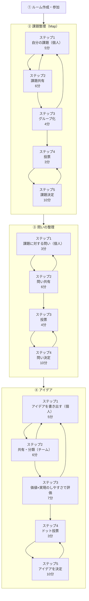

# デザインスプリントの進行仕様

[PRD](../prd.md)の詳細仕様。全14ステップの進行・目安時間・ガイド・機能可否と、共通の表示・保存要件をこの文書で更新する。旧フェーズ設計・機能対応表・PRDの詳細記述を統合した。キャンバスの入力・選択・移動・取消・Undoは[キャンバス操作仕様](canvas-interactions.md)を参照する。工程の機能可否は引き続きこの文書を正本とする。

## 全体像



時間はタイマーの初期値。共有の発表はステップ移行時に自動開始し、それ以外の開始・進行はホストが手動で行う。時間切れで自動遷移しない。

## 共通の振る舞い

- **1画面 = 1フェーズ**：フェーズをまたいで迷わないよう、画面遷移とフェーズを一致させる
- **現在地は小さな白いカードから開く**：左上にはフェーズ名・ステップ番号（例：① 課題整理・1/5）と進み具合の点だけを表示する。点は課題5・問い4・アイデア5個で、到達した位置まで濃くし、現在の点は輪でも区別する。開始前は「開始待ち」とし、点は表示しない。点から工程は移動できない。決定した問い・課題は既存の参照欄で一度に1項目ずつ開ける。
- **現在地を開くと3フェーズの流れと手順が見える**：現在地は小さな表示と展開表示の2状態とする。開くたびに現在フェーズの手順から始める。「①課題 → ②問い → ③アイデア」は番号と矢印で3段階を示す、押せる閲覧タブにする。選択したフェーズの5／4／5件の正式な作業名のみを表示し、現在の作業を強調する。現在地より前のフェーズと、現在フェーズ内で現在より前の手順には完了チェックを付ける。現在とこれからの手順は番号を残し、開始前は完了チェックを出さない。上の現在地と、進行中フェーズの番号の強調は固定し、閲覧タブの選択とは分ける。タブを切り替えてもルームの工程は変更しない。ゴール・役割・具体的な進め方は既存の進め方で読む。
- **開閉の操作を上の現在地へ集める**：上の行・矢印の再クリック、外側クリック、Escapeで小さな表示へ戻る。「全手順を見る」「概要に戻る」「下の閉じる」と下段の区切り線は設けない。外側の付箋や別の操作を押すと畳み、同じ操作を実行する。Escapeでは入口へフォーカスを戻す。タブから外へフォーカスを移した場合は移動先を保つ。工程変更時も畳み、読んでいた要素が消えた場合は常設入口へ復帰する。開閉・閲覧タブは本人の画面内の状態で、付箋入力・ボード位置・参照欄の開閉を変えない。
- **右上メニューからフィードバックを開く**：右上の「…」メニューに吹き出しアイコン付きのフィードバック入口を置く。現在地が開いていてもメニュー操作で畳み、メニューから既存の入力を開く。入力欄を閉じると右上の常設入口へフォーカスを戻す。未送信の入力がなければ現在ステップを対象にし、既存の入力がある場合は選んでいた対象と内容を保持する。成果画面の既存入口も維持する。
- **狭い画面でも手順と開閉へ到達できる**：広い画面では同じ白いカードを下へ広げ、参照欄・進め方・ヒントに重ねる。開閉で下の情報・付箋・キャンバスを動かさない。640px未満では中央で読む表示にし、一覧だけをスクロールできるようにする。1280×720・390×844・320×568で長い作業名、3フェーズのタブ、上の開閉入口、右上のフィードバック、閉じた後のヒント・マイ付箋・主要操作への到達性を確認する。
- **各フェーズの最後に「成果物を決定」する**：課題・問い・アイデアを都度確定し、次フェーズに引き継ぐ
- **ファシリテーションガイドが各ステップを案内**：画面上中央の一つの枠に、初めてのステップでは最初の一歩とコツを短く表示する。約5秒後に「？ 進め方」へ畳み、押すと同じ枠が詳細説明へ広がる（約260ms、動きを減らす設定では省略）。詳細には手順・具体例・次へ進む目安を示し、ホストだけに進行指示を追加する。ガイド内に作業開始・閉じるボタンは置かず、外側クリックは折り畳みと元の操作を同時に行う。Escapeは入口へ戻し、Tabで外へ出た場合は移動先のフォーカスを保つ。自動表示はフォーカスを奪わず、読込中・別タブ表示中・hover・focus中は残り時間を止める。自分で開いた詳細は時間で閉じない。同じルーム・参加者・タブでは一度見た工程を再案内せず、開閉を他の参加者と共有しない。開閉で作業領域や付箋を動かさない。
- **個人ワークの付箋は本人にのみ表示され、手動操作で共有される**：各フェーズの個人ワークステップ（Step1）で書いた付箋は、自分にしか見えない状態でその場に増えていく。タイマー終了後、本人が手動でドラッグ＆ドロップして共有スペースへ移動させることで、初めて他メンバーに見えるようになる
- **付箋ごとに本文の文字サイズを選べる**：選択中の付箋は、キャンバスのズームとは独立した左下の操作から12〜24pxを1px刻みで変更できる。初期値と既存付箋は14pxとし、設定はRoomDOへ保存してマイ付箋から共有した後も参加者間で同じ見た目を保つ。幅は200pxのまま、本文が長い場合は選んだ文字サイズを縮小せず、最大2,000文字の全文が見える高さまで縦へ伸ばす。通常の読み方を固定高の内部スクロール、別欄、モーダル、一時展開へ切り替えない。
- **進行は現在のホストが行う**：次のフェーズ・次のステップへの進行は、現在のホストがチェックすることで全員の画面に反映される方式で実装を進める。デザインスプリントは時間を厳守して進める性質が強いため、全員のチェックを待つよりホストの操作を優先する。
- **共有の発表完了は本人も操作できる**：共有ステップでは、現在の発表者本人も「次の人へ」で発表を終えられる。開始・パス・ステップ移行はホストだけが操作し、交代予告中や切断中は発表完了を操作できない。サーバーは現在の発表者・ステップ・版を確認し、重複や古い要求で二人先へ進めない。
- **主要操作と参照情報を見ながら作業できる**：1280×720で主要操作と補助パネルが重ならず、狭い画面でも現在のステップ・進捗・タイマー・次への操作を確認できる。問いの作成時は採用した課題、アイデア作成時は採用した問いを進め方と同時に参照でき、長文も全文を読める。
- **補助情報を必要に応じて開閉できる**：進行HUDの補足情報は初期状態で閉じ、必要な項目だけ展開する。進め方・採用内容・ヒント・マイ付箋は独立して開閉でき、進行HUD内は一度に1項目だけ開く。開閉状態は各参加者の画面内で扱い、閉じても入力内容やキャンバスの表示位置を保つ。マイ付箋は1-1・2-1・3-1では最初から開き、それ以外は折り畳んで始める。
- **共有へ入ったら最初の発表を自動で開始する**：1-2・2-2・3-2への移行時に、サーバーが同じ順番の先頭を発表者として設定する。2秒の予告後、保存された持ち時間（初回は3分）で計時を始める。追加執筆から共有へ戻る場合も先頭から始める。再接続では現在の発表を復元し、開始し直さない。更新前の待機ルームと一巡後に参加者が加わった場合は、ホストの開始操作を残す。時間切れでは発表者・ステップを自動で進めない。
- **タイマーとHUDは不透明にする**：開始前・実行中・一時停止・終了でタイマーの寸法と読みやすい背景を維持する。透明効果を減らす設定でもHUDを不透明にし、設定画面もボード内容と混ざらない。
- **タイマーは推奨時間から手動で開始する**：開始前からタイマー枠に各ステップの推奨時間を表示するが、共有の発表開始を除いて自動開始せず、自動進行は行わない。実行中は「＋1分」「一時停止」、一時停止中は「再開」「終了」の2操作だけを表示する。操作パネル内ではステータスと時間を重複表示せず、操作だけを示す。タイマー枠も一時停止・終了の文字や記号を時間に併記せず、時間表示と色で状態を区別する。手動終了・時間切れは共有された終了状態としてタイマー枠に00:00を示し、「もう一度」で直前と同じ時間を開始できる。「設定し直す」では推奨時間の設定画面へ戻り、自動開始はしない。成功したステップ移行ではタイマーを停止し、次ステップの推奨時間へ戻す。
- **運営者が節目の共有盤面と進行時刻を見返せる**：全ルームで、3フェーズ・14ステップを離れる直前の共有盤面を記録する。書き足し・再投票も別記録とし、本文・位置・グループ・色・文字サイズ・重なり・候補外表示・2軸マップの広さ・採用済みの決定内容を固定する。公開済みの主観票・客観票は別々に残し、投票中の現在フェーズの票数は記録しない。最終盤面は初回の成果公開で保全した成果を参照する。
- **進行時刻は訪問順に確認する**：受理した開始・通常移行・書き足し・再投票・初回の成果公開を連番で記録し、各ステップの開始・終了・時間差を表示する。時間差には休憩・会話・切断中を含み、迷いや不具合とは断定せず、合計表も設けない。閉じただけの区間は「終了未記録」、導入前など開始が分からない区間は「開始時刻不明」とし、時間差を推測しない。拒否・キャンセル・二重送信・成果の再表示では記録を増やさない。
- **途中記録の欠落と未反映を区別する**：途中の盤面保全に失敗しても、移行時刻と欠落を永続化できれば進行する。時刻と欠落も保存できなければ進行を成立させない。保全済みの盤面は記録ごとに自動再試行し、後の盤面で上書きしない。最終完了は完了成果自体を保全するまで成立させない。
- **運営向け記録は権限と期限を共用する**：`/shared-outcomes` のルーム詳細から時系列を分割取得し、選択した記録だけの盤面・全文・記録時刻・保存状態を読み取り専用で表示する。正常な空盤面・反映待ち・反映失敗と再試行中・復元不可の欠落・取得エラーを区別する。Googleログインと現在の `shared_outcomes:read` を取得のたびに確認し、未完了は最後の利用から30日、本人向け再訪の対象となる完了ルームは初回完了から30日で取得拒否・削除する。解散後も期限までは保持し、閲覧・再試行で延長しない。未共有メモとその枚数、作者属性、参加者一覧、個人の投票先・シール位置、入力履歴、画面画像・動画は記録しない。共有本文内の氏名の自動匿名化は行わない。
- **採用案の決定後にホストが成果を公開する**：Step 3-5では「次のステップへ」を表示せず、採用する付箋を選んだ後も全員がボードに留まる。ホストだけに完了チェックのアイコンボタンを表示し、押した時点で全員に成果画面を表示する。決定した課題・問い・採用案を読み取り専用の付箋風カードで確認でき、.txt 保存と全文コピーで持ち帰れる。完了後の作業更新・参加・解散は拒否し、ホストも本人の退出だけができる。成果を残してホームへ戻れば閲覧権は残る
- **退出時に成果の閲覧権を選ぶ**：参加者はロビー・作業画面・完了画面の退出確認で「成果を残して退出」（初期選択）か「成果を残さず退出」を選ぶ。残した人は、ルーム完了後にホームの「過去の成果を見る」から振り返れる。残さない退出は本人の一覧・詳細・経緯の閲覧権を持たず、完了後でも撤回できる。他の参加者の成果や共有付箋は削除しない。どちらも在籍・作業用REST・WSのアクセスを失う。未完了なら招待URLから再参加でき、次の退出で選択し直せる。ホストは完了前に解散のみ可能で、本人だけの退出にはホストを引き継ぐ。選択のない旧クライアントは完了前は成果を残さず、完了後は既存の閲覧権を維持する。導入前の途中退出へは遡及しない。
- **成果を残した参加者が30日間再訪できる**：ホームの「過去の成果を見る」から、本人が初回完了時に在籍したルームと、成果を残して途中退出したルームを完了日時・ルームIDの安定した順序で分割取得する。成果の3件を先に表示し、作業用接続なしで全文コピー・テキスト保存できる。「検討の経緯を見る」は初期状態で閉じ、課題グループ化（1-3→1-4）、課題決定（1-5→2-1）、問い決定（2-4→3-1）、2軸配置（3-3→3-4）、アイデア決定（初回成果公開）の5場面を表示する。最後に通常前進した回を連番で選び、完了時に記録参照を固定する。戻る直前や前の回・現在盤面では代用しない。空盤面・保全できなかった欠落・導入前・反映待ち・反映失敗と取得エラーを区別し、狭い画面でも選択・全文・再取得に到達できる。
- **再訪の対象と期限を保全する**：RoomDOが初回完了と同じトランザクションで成果3件・日時・30日期限・在籍者のアカウントID・5場面と再試行情報を保全する。切断中の在籍者と、成果を残して途中退出した参加者を含める。成果を残さず退出した人は含めず、完了と退出が競合しても本人の閲覧権を撤回する。再送・閲覧・再試行で権利を追加せず、退出でも期限は延長しない。期限ちょうどから一覧・詳細・盤面を拒否し、元付箋・運営向け成果・履歴・本文outbox・閲覧者・D1索引を削除する。削除失敗を再試行し、削除済み識別情報だけを残して復活を防ぐ。導入後に初回完了する既存ルームも含めるが、導入前の公開済みルームへ遡及しない。本人向け応答は共有本文の明示的な投影とし、未共有内容・参加者属性・票数・順位・投票履歴を含めない。
- **画面下から1件を最終決定する**：Step 1-5・2-4・3-5の採用前は、ホストに「もう一度投票する」「採用する付箋を選ぶ」を下中央に示す。選択開始後にボードの候補をクリックすると、確認ダイアログを挟まず確定する。決定後は再投票・候補整理・移動を止め、ホストだけに「確定を取り消す」を示す。次フェーズへの進行前、または最終成果の公開前なら、取消で採用前へ戻して選び直せる。取消は決定だけを解除し、本文・票・候補外・位置・下書き・過去フェーズの決定を保持して全員へ同期する。古いタブから届く別候補の取消は拒否する。空白クリックやドラッグ終了は選択に扱わず、キャンセル・Escape・ステップ変更・切断で選択を解除する。個人・候補外・別フェーズの付箋は対象外とする。RoomDOがホスト・現在フェーズ・共有候補・未確定を再検証し、全員へ同期する。最多票の自動採用は行わず、1位以外や候補1件も直接決定できる。確定後は下中央の2操作を取消ボタン付きの決定表示へ置き換え、フェーズ1・2は右上から次フェーズへ、フェーズ3はホストの完了操作までボードに留まる。
- **必要に応じて追加の個人作業へ戻る**：共有中と1-3・3-3では、通常の前進を右上に保ち、ホストの「もう一度付箋を書く」を下中央に示す。確認して全員が同フェーズのStep1へ戻り、タイマーを停止する。共有済み付箋は位置・グループ・評価位置を保って閲覧のみ、未共有の下書きは本人だけに見える。追加後はStep2で本人がドラッグして共有する。同フェーズの下書きは保持し、次フェーズへの移行または最終フェーズの完了時に破棄する。最初の投票開始前に、以降は共有へ戻れず、残る下書きはフェーズ終了時に破棄されると警告する。
- **決定前は候補を動かして何度でも再投票できる**：全参加者が候補を移動でき、本文・作者・色・票・グループ・候補状態は変えない。3-5では価値×実現のしやすさのマップ内で評価位置を見直す。候補外はその場で薄く表示し、採用前は全参加者が移動できる。復帰・Undoは候補状態だけを戻し、現在位置を保持する。決定中の新規作成・本文編集・削除は禁止する。再投票確認は候補件数と「付箋は消えません」を示し、候補本文の一覧は載せない。確認した時点で当該フェーズの票を候補外も含めすべて消し、主観1票・客観3票と全員の未完了状態へ戻す。キャンセル、移動、除外・復帰だけでは票を消さない。他フェーズの票は保持し、投票中は本人の今回票だけを配信・表示する。投票中の移動・内容変更・候補整理は禁止する。結果は決定ステップの各付箋上に主観票・客観票を表示する。投票結果モーダルとその再表示ボタンは設けない。主観5点・客観1点、既存の未完了者への進行規則を維持する。参加者向けの投票履歴・比較は提供しない。運営向けの進行記録では、決定ステップを離れる直前の公開済み主観票・客観票を、再投票前も含めて保存する。候補0件は投票・採用・次フェーズ進行を止め、ホストへ候補の復帰、参加者へ待機を案内する。
- **繰り返しても作業位置を保つ**：追加・共有と再投票の回数制限は設けない。ループでパン・ズーム・配置をリセットせず、再訪時の導入説明を強制しない。遷移時はタイマーを止め、移動先の目安時間から手動で開始する。進行・決定で同時に実行できる主要操作は画面全体で最大2つとし、重複配置しない。採用前の右上の進行ボタンは無効状態で位置を保持し、最終採用前は操作欄の幅のみを保持する。決定から個人・共有・整理・評価へ戻る操作、過去フェーズへの移動は設けない。確定を取り消した場合は、同じ決定ステップで再投票・候補整理・移動・再採用ができる。次フェーズへ進んだ決定と公開済みの成果は取り消せない。
- **決定時に候補を一時的に外せる**：Step 1-5・2-4・3-5ではホストだけが、個別の付箋を確認なしで候補外にできる。直後の Undo、右クリック、ホバー・フォーカス・タップから同じ位置へ戻せる。投票が全員完了した通常進行では、主観票・客観票ともに投票のない共有済み候補を決定ステップへの移行と一体で自動的に候補外にし、全候補が0票の場合や投票未完了の強制進行では自動整理しない。自動整理の理由と件数を全員へ案内し、ホストはその操作で外れたままの候補だけをまとめて元へ戻せる。決定ステップでは、同じ0票候補を対象件数の確認後に手動でも一括整理できる。対象は実行時にサーバーで再判定し、一括操作で実際に外した候補のうち現在も同じ操作由来で候補外のものだけをまとめて元へ戻せる。候補外でも本文・票・座標・大きさ・グループ・マップ位置を保持し、全員に同じ場所のゴーストとして表示する。候補数・集計・決定対象からは除き、候補が0件なら決定・次フェーズ進行を止める。別一覧、任意の複数選択、完全削除は設けない。採用確定中は除外・復帰を含む候補整理を止め、確定を取り消すと再開できる。
- **投票は個々の付箋に対して行う**：共有・分類ステップでのグルーピングは、あくまで整理のための表示上の分類とし、ステルス投票の対象はグループ単位ではなく常に個々の付箋とする。グループ単位で投票できるようにすると発散・収束の流れが崩れるため、案そのものへの投票にとどめる。
- **主観・客観シールはドラッグ＆ドロップで付箋上に貼る**：ステルス投票の🔴主観シール・🔵客観シールは、パレットから対象の付箋へドラッグ＆ドロップする。貼り付けた付箋内の相対座標を保存し、投票中は本人のシールだけを表示する。結果ステップではシール群を種別ごとに集計し、従来の付箋ごとの票数 UI でも確認できる。
- **投票完了状態だけを全員へ共有する**：投票中は投票先・票種別ごとの残数・カーソル位置を本人以外へ共有せず、主観1票と客観3票を使い切ったメンバーの完了チェックだけを全員へ表示する。票を取り消すと未完了に戻り、フェーズをまたいで持ち越さない。
- **投票基準を全ステップで揃える**：1-4、2-3、3-4では、投票対象を「現在のフェーズの個々の付箋」とし、主観は「激しく共感する、取り組みたい」、客観は「自分以外の人にも価値がありそう」という一文だけを表示する。主観1票・客観3票を使い、シールを付箋へ貼る。貼った自分のシールは押して取り消せるほか、投票パレットへ戻しても1票取り消せる。2-4は投票ではなく問いの決定ステップとする。
- **カーソルに参加者名を表示し、共同作業感を演出する**：他メンバーのカーソル位置には表示名を表示する。個人ごとの表示切り替えは設けず、共有ステップでは常に表示する。ただし、ステルス投票中のカーソルは非表示。
- **共有付箋のドラッグは名前付きカーソルで示す**：ドラッグ中も通常のメンバー色カーソルと表示名だけを掴んだ位置へ追従させ、静止中も薄くしない。付箋には操作者名や操作者色の枠を重ねず、本文・作者色・選択表示を維持する。
- **メンバー色は作者の付箋に対応し、参加順の固定優先順で割り当てる**：RoomDO が新しい参加者に最初の未使用色を割り当てる。退出者の色は再利用せず、再参加者は以前の色を使う。付箋・アバター・カーソルの対応を保ち、色IDは既存データと通信の互換性のため維持する。
- **共有付箋の移動は先勝ちの排他操作にする**：クリック選択だけでは操作権を取得せず、ドラッグ閾値を超えた後にサーバーが最初に受理した1接続だけへ操作権を与える。操作権を持たない接続による途中移動・位置確定・非共有化は拒否し、操作中も本文編集は許可する。拒否された側は付箋を一時的にも移動せず、解放後は改めて取得できる。
- **ドラッグ中断時はサーバー確定位置へ収束する**：pointerup は最終位置を確定し、pointercancel・カーソル退出・切断・メンバー離脱・フェーズ変更・snapshot 再同期では操作権とドラッグ表示を残さず、最後にサーバーが受理した位置へ全画面を収束させる。再接続後や遅延到着した古い操作 ID で操作権や位置を復活させない。
- **非公開の操作情報を共有しない**：private 付箋、別フェーズの付箋、ステルス投票中のカーソルについて、位置・操作権・取得可否を他メンバーへ配信しない。

## ルーム作成・参加

ルーム作成・招待コード発行・参加・メンバー一覧（表示名のみ）を提供する。全員の参加を確認し、ホストが開始すると課題整理のStep1へ進む。

作成者を最初のホストとする。開始前と作業中に、現在ホストが同じルームの接続中メンバーを選び、対象名と開始・進行・解散の権限を確認して引き継げる。ロビーの参加者表示、作業画面の参加者一覧、共有中の順番一覧から相手を選ぶ。常設のホスト変更ボタンは増やさない。移譲先の受諾待ちは設けず、新ホストから再移譲できる。全員のホスト表示と操作を更新し、旧ホストは一般参加者になる。引き継ぎだけではステップ・タイマー・発表順・付箋・投票・進捗を変更しない。完了したルームは閲覧専用とし、引き継ぎできない。切断や再接続で自動選出・自動復帰は行わない。進行・退出・移譲が重なった場合はサーバーが受理した順に決定し、古いホスト世代の要求は拒否する。作成者の表示と現在のホストは区別する。

案内例：「ようこそ！皆さんで課題を整理し、アイデアを考えていきます。画面のガイドが順番に案内します。」

## 対応表の読み方

| 記号 | 意味               |
| ---- | ------------------ |
| ○    | 対応・使用する     |
| △    | 任意表示・参照のみ |
| ×    | 非対応             |

「共有ドラッグ＆ドロップ」は個人用から共有への移動だけでなく、共有候補の位置変更を含む。決定ステップの○は採用前の通常候補・候補外の両方を含み、投票中・採用後は移動できない。タイマーの○は利用できることを示し、時間切れで進行を強制する意味ではない。

## 共有付箋の移動と候補整理

現在フェーズの共有済み付箋は、ホスト・参加者ともに共有・整理・評価（1-2・1-3・2-2・3-2・3-3）と採用前の決定（1-5・2-4・3-5）で移動できる。候補外も同じ権限を持つ。個人作業（1-1・2-1・3-1）、投票（1-4・2-3・3-4、再投票を含む）、採用確定後・成果公開後と過去フェーズは位置を固定する。以下の機能対応表の共有ドラッグ＆ドロップは、この範囲で通常候補・候補外の両方を対象とする。未共有付箋は既存の本人の個人エリア操作に従い、移動だけで共有しない。

候補外は本文・票・グループ・現在位置を保持し、候補数・集計・再投票・採用から外す。薄い表示と「候補外」を残し、ホバー・フォーカス・選択時は本文を読みやすくする。候補0件でも閲覧・移動・復帰は可能だが、再投票・採用・次フェーズ進行は停止する。

除外・復帰は採用前の決定ステップでホストだけが行う。ホバー・フォーカスでは一時的にボタンを表示し、クリック・タップ・キーボードの選択操作で本人の画面の1枚に表示を固定する。別の付箋へのホバーと固定表示は共存する。操作ボタンを押してもその付箋を選択し、除外・復帰後も選択を保つ。ドラッグ中はボタンを隠す。空白のクリック・Escapeで解除し、背景パン・タイマー操作・フォーカス移動だけでは解除しない。ステップ変更・切断・採用選択開始では解除する。

採用選択中も全員が移動でき、候補のクリックだけで採用する。候補外クリックやドラッグ終了では採用せず、ホストの候補整理ボタンは隠す。採用・再投票・ステップ移行の成立時にはドラッグを止め、最後にサーバーが受理した位置に揃える。確定取消では位置・票・候補状態を戻さず、その決定ステップの移動・候補整理を再開する。

個別の候補操作は本人の表示へ即時反映し、同じ付箋の操作とホストの進行・採用・再投票は確定まで止める。成功通知とUndoはサーバーの成功確認後に出す。失敗時は最新の候補状態へ戻して理由を表示し、並行した移動は戻さない。切断後は再接続の最新状態を使う。個別・一括のUndoは、その操作による除外が残る付箋の候補状態だけを戻し、別タブの後続操作を取り消さない。移動や別付箋の操作だけではUndoを無効にしない。

## フェーズ1：課題整理（Map）

**フェーズの目的**：解くべき課題を決定する

| Step                     | 時間 | 機能                                           | 参加者向けガイド                                                                                                                     | ホスト限定の進行指示                                                                                                         |
| ------------------------ | ---: | ---------------------------------------------- | ------------------------------------------------------------------------------------------------------------------------------------ | ---------------------------------------------------------------------------------------------------------------------------- |
| Step1 自分の課題（個人） |  5分 | 個人専用付箋 / タイマー / 1枚につき1テーマ     | 詳細の見出しで「最近あった困ったことを付箋に書き出そう。」、いまやることで「1枚につき1つ書こう。」と案内する。                       | 「タイマーが終了したら、次のステップへ進んでください。」                                                                     |
| Step2 課題共有           |  6分 | ホワイトボード / 順番に発表                    | 「自分の付箋をドラッグしてみんなに共有しよう。順番を決めて発表しよう。」                                                             | 「全員の共有が終わったら、次のステップへ進んでください。」                                                                   |
| Step3 グループ化         |  4分 | グルーピング                                   | 「共有した付箋のうち、似ているものを近づけてグループに分けよう。」                                                                   | 「グループ化が終わったら、次のステップへ進んでください。」                                                                   |
| Step4 投票               |  3分 | 🔴主観ドット×1 / 🔵客観ドット×3 / ステルス投票 | 「主観1票・客観3票を使い、現在のフェーズの個々の付箋へ投票します。」投票対象・主観・客観の基準と、貼り付け・取り消し操作を表示する。 | 「全員の投票が終わったら、次のステップへ進んでください。」                                                                   |
| Step5 課題決定           | 10分 | 投票結果表示 / 取り組む課題の確定              | 「投票結果を参考に、取り組む課題をみんなで1つ決めよう。」                                                                            | 「候補を動かして話し合い、必要なら再投票してください。採用する付箋を選ぶと決定します。決定後、次フェーズへ進んでください。」 |

### 機能対応表

| Step                  | マイ付箋（執筆） | マイ付箋エリア（表示） | タイマー | 共有ドラッグ＆ドロップ | 付箋の内容編集 | 投票 | 投票結果 | グループ操作 | グループ表示 | 2軸マッピング | 発想支援ツール |
| --------------------- | ---------------- | ---------------------- | -------- | ---------------------- | -------------- | ---- | -------- | ------------ | ------------ | ------------- | -------------- |
| 1. 自分の課題（個人） | ○                | ○                      | ○        | ×                      | ○              | ×    | ×        | ×            | ×            | ×             | ×              |
| 2. 課題共有           | ×                | ○                      | ○        | ○                      | ○              | ×    | ×        | ×            | ×            | ×             | ×              |
| 3. グループ化         | ×                | ×                      | △        | ○                      | ×              | ×    | ×        | ○            | ○            | ×             | ×              |
| 4. 投票               | ×                | ×                      | △        | ×                      | ×              | ○    | ×        | ×            | ○            | ×             | ×              |
| 5. 課題決定           | ×                | ×                      | △        | ○                      | ×              | ×    | ○        | ×            | ○            | ×             | ×              |

### 設計メモ

- 「マイ付箋」は執筆と表示で可否がずれるため2列に分ける。「マイ付箋（執筆）」は
  マイ付箋を新しく書き起こせるか、「マイ付箋エリア（表示）」は画面にマイ付箋の
  領域が出ているか。Step2（課題共有）は新しく書けない（×）が、書き上げた付箋を
  共有ボードへ上げる・戻す操作の起点なのでエリアは必須（○）。
- 同フェーズ内では未共有の下書きを保持する。Step2や整理・評価からStep1へ戻り、共有済み付箋を閲覧しながら追加できる。下書きは本人にのみ見え、再びStep2で本人がドラッグするまで公開しない。次フェーズへの移行または最終フェーズの完了時にRoomDOが当該フェーズの下書きを破棄する。最初の投票開始時に、以降は共有へ戻れず残る下書きがフェーズ終了時に破棄されると確認する。
- Step2（課題共有）では、付箋同士を近づけても自動グルーピングされないようにする。
  自動グルーピングはStep3（グループ化）専用の挙動とする。
- 「付箋の内容編集」はStep1・Step2でのみ許可する。Step1は個人作業中の書き直し、
  Step2は発表中に見つかった誤字脱字の修正を想定したもの。Step2で共有済み
  （shared）の付箋は既存の共同編集仕様（`workers/room/notes.ts` の `canEdit()`）
  により投稿者本人に限らずルームメンバー誰でも修正できる（`note:move` /
  `note:drag` と同じ共同編集モデル）。Step3（グループ化）以降は、グルーピング・
  投票・集計という合意形成に集中させるため付箋の文言そのものを変える操作は
  許可しない。
- 2軸マッピングはフェーズ3（アイデア）専用の機能のため、本フェーズでは全ステップ×。
- 発想支援ツール（SCAMPER等）もフェーズ3専用の機能のため、本フェーズでは全ステップ×。
- ステップ単位でのWSメッセージ実装ゲーティング（`isBoardMutation()` の
  拡張対象表）は実装が変わるたびに変更が必要な実装レベルの詳細のため、
  本表ではなく [Discussion #36](https://github.com/engineer-first/idea-boost/discussions/36)
  で管理する。

## フェーズ2：問いの整理

**フェーズの目的**：課題をアイデアが生まれる「問い」に変換する

| Step                           | 時間 | 機能                                                                                                                                                                                                                                                                                                      | 参加者向けガイド                                                                                                                     | ホスト限定の進行指示                                                                                                         |
| ------------------------------ | ---: | --------------------------------------------------------------------------------------------------------------------------------------------------------------------------------------------------------------------------------------------------------------------------------------------------------- | ------------------------------------------------------------------------------------------------------------------------------------ | ---------------------------------------------------------------------------------------------------------------------------- |
| Step1 課題に対する問い（個人） |  3分 | 決定した課題を画面上部に固定表示 / 「どうしたら私たちは、もっと〇〇できるだろう？」の見出しを1回だけ固定表示し、付箋には〇〇部分（問いの本体）のみ入力 / テンプレート（もっと簡単に / もっと安心して / もっと楽しく / もっと短時間で / もっと継続して）を選ぶと入力欄へ挿入 / 例の付箋2枚をマイ付箋に表示 | 「何をよくしたいのかがわかる質問を、付箋に書こう。」                                                                                 | なし                                                                                                                         |
| Step2 HMW共有                  |  6分 | HMW共有                                                                                                                                                                                                                                                                                                   | 「自分の付箋をドラッグしてみんなに共有しよう。順番を決めて発表しよう。」                                                             | 「全員の共有が終わったら、次のステップへ進んでください。」                                                                   |
| Step3 投票                     |  4分 | 🔴主観ドット×1 / 🔵客観ドット×3 / ステルス投票                                                                                                                                                                                                                                                            | 「主観1票・客観3票を使い、現在のフェーズの個々の付箋へ投票します。」投票対象・主観・客観の基準と、貼り付け・取り消し操作を表示する。 | 「全員の投票が終わったら、次のステップへ進んでください。」                                                                   |
| Step4 HMW決定                  | 10分 | 投票結果表示 / HMWの確定                                                                                                                                                                                                                                                                                  | 「投票結果を参考に、HMWをみんなで1つ決めよう。」                                                                                     | 「候補を動かして話し合い、必要なら再投票してください。採用する付箋を選ぶと決定します。決定後、次フェーズへ進んでください。」 |

### 機能対応表

| Step                       | マイ付箋（執筆） | マイ付箋エリア（表示） | タイマー | 共有ドラッグ＆ドロップ | 付箋の内容編集 | 投票 | 投票結果 | グループ操作 | グループ表示 | 2軸マッピング | 発想支援ツール |
| -------------------------- | ---------------- | ---------------------- | -------- | ---------------------- | -------------- | ---- | -------- | ------------ | ------------ | ------------- | -------------- |
| 1. 課題に対するHMW（個人） | ○                | ○                      | ○        | ×                      | ○              | ×    | ×        | ×            | ×            | ×             | ×              |
| 2. HMW共有                 | ×                | ○                      | ○        | ○                      | ○              | ×    | ×        | ×            | ×            | ×             | ×              |
| 3. 投票                    | ×                | ×                      | △        | ×                      | ×              | ○    | ×        | ×            | ×            | ×             | ×              |
| 4. HMW決定                 | ×                | ×                      | △        | ○                      | ×              | ×    | ○        | ×            | ×            | ×             | ×              |

### 設計メモ

- 「付箋の内容編集」の許可範囲・共同編集の考え方はフェーズ1と同じ
  （Step1・Step2のみ許可。詳細はフェーズ1の設計メモを参照）。
- フェーズ2ではグルーピングを行わないため、グループ操作・グループ表示は
  全ステップで×。
- 2軸マッピングもフェーズ3（アイデア）専用の機能のため、本フェーズでは全ステップ×。
- 発想支援ツール（SCAMPER等）もフェーズ3専用の機能のため、本フェーズでは全ステップ×。
- タイマー・投票・投票結果の必須/任意パターンはフェーズ1と同じ考え方を踏襲
  （個人作業・共有は必須。投票・投票結果自体も各ステップで必須〔○〕であり、
  任意〔△〕になるのはタイマーのみで、投票以降はタイマー表示が任意になる）。

## フェーズ3：アイデア決定

**フェーズの目的**：HMWに対する解決策を考え、最も価値のあるアイデアを決定する

| Step                             | 時間 | 機能                                                                                                                                                                               | 参加者向けガイド                                                                                                                     | ホスト限定の進行指示                                                                         |
| -------------------------------- | ---: | ---------------------------------------------------------------------------------------------------------------------------------------------------------------------------------- | ------------------------------------------------------------------------------------------------------------------------------------ | -------------------------------------------------------------------------------------------- |
| Step1 アイデアを書き出す（個人） |  5分 | 個人作業 / タイマー / 付箋入力 / サイドバーに発想支援ツール（オズボーンのチェックリスト・SCAMPER・逆転発想・他業界事例）                                                           | 「決定したHMWをもとに、アイデアを付箋に書き出そう。書き終えたら手を止めて待とう。」                                                  | 「個人ワークの時間を守って進行してください。」                                               |
| Step2 共有・分類（チーム）       |  6分 | 順番に発表 / 共有ドラッグ＆ドロップ / 2軸マッピングへの配置（自由に動かせる） / 発想支援ツール（任意表示）                                                                         | 「アイデアをみんなに共有し、発表しながら2軸マップに置こう。ほかの人が発表している間は手を止めて聞こう。」                            | 「全員の共有が終わったら、次のステップへ進んでください。」                                   |
| Step3 価値×実現のしやすさで評価  |  7分 | 2軸マッピング（縦軸：選定した課題・HMWへの価値〔上に行くほど高い〕、横軸：実現のしやすさ〔右に行くほど実現しやすい〕）／ チームの合意のもと位置を確定／ 全参加者が候補を移動できる | 「付箋を動かし、縦軸の「価値」と横軸の「実現のしやすさ」で評価しよう。」                                                             | 「評価が終わったら、次のステップへ進んでください。」                                         |
| Step4 ドット投票                 |  3分 | 🔴主観ドット×1 / 🔵客観ドット×3 / ステルス投票                                                                                                                                     | 「主観1票・客観3票を使い、現在のフェーズの個々の付箋へ投票します。」投票対象・主観・客観の基準と、貼り付け・取り消し操作を表示する。 | 「全員の投票が終わったら、次のステップへ進んでください。」                                   |
| Step5 アイデアを決定             | 10分 | 投票結果表示 / 採用アイデアの確定                                                                                                                                                  | 「投票結果を参考に、採用するアイデアをみんなで1つ決めよう。」                                                                        | 「採用する付箋を選ぶと決定します。決定後、ホストが完了操作を行うと全員に成果を表示します。」 |

### 機能対応表

| Step                          | マイ付箋（執筆） | マイ付箋エリア（表示） | タイマー | 共有ドラッグ＆ドロップ | 付箋の内容編集 | 投票 | 投票結果 | グループ操作 | グループ表示 | 2軸マッピング | 発想支援ツール |
| ----------------------------- | ---------------- | ---------------------- | -------- | ---------------------- | -------------- | ---- | -------- | ------------ | ------------ | ------------- | -------------- |
| 1. アイデアを書き出す（個人） | ○                | ○                      | ○        | ×                      | ○              | ×    | ×        | ×            | ×            | ×             | ○              |
| 2. 共有・分類（チーム）       | ×                | ○                      | ○        | ○                      | ○              | ×    | ×        | ×            | ×            | ○             | △              |
| 3. 価値×実現のしやすさで評価  | ×                | ×                      | △        | ○                      | ×              | ×    | ×        | ×            | ×            | ○             | ×              |
| 4. ドット投票                 | ×                | ×                      | △        | ×                      | ×              | ○    | ×        | ×            | ×            | △             | ×              |
| 5. アイデアを決定             | ×                | ×                      | △        | ○                      | ×              | ×    | ○        | ×            | ×            | ○             | ×              |

### 設計メモ

- 「付箋の内容編集」の許可範囲・共同編集の考え方はフェーズ1と同じ
  （Step1・Step2のみ許可。詳細はフェーズ1の設計メモを参照）。
- グルーピング（グループ操作・グループ表示）は行わないため全ステップ×。
  代わりに2軸マッピング（価値×実現のしやすさ）で位置付けを行う。
- Step1へ戻ったときも、共有済みアイデアは2軸マップ上の同じ位置で閲覧できる。初回の下書きだけのStep1ではマップを表示しない。
- 2軸マッピングはStep2（共有・分類）の時点ですでに配置操作が可能（○）。
  Step3でチームの合意のもと位置を確定する（○）。
- Step4（投票）では2軸マッピングは表示のみ（△）。Step5の最終決定前は、全参加者が候補をマップ内で動かして評価位置を見直せる（○）。候補外もマップ内で移動でき、復帰・Undoで以前の評価位置には戻さない。最終決定後は移動できない。再投票と結果表示でも位置を保持する。
- 発想支援ツール（オズボーンのチェックリスト・SCAMPER・逆転発想・他業界事例）は
  Step1（アイデアを書き出す）で必須表示（○）。Step2（共有・分類）では、他の人の発表を
  聞きながら参照してよい任意表示（△）として残す。Step3以降は2軸マッピングでの
  合意形成に集中するため非表示（×）にする。

## HMW入力の具体例

### 入力

付箋には見出しの「どうしたら私たちは」を繰り返さず、〇〇部分（問いの本体）のみ入力する。

```text
〇〇できるだろう？
```

### テンプレート

選ぶと入力欄の先頭に挿入される修飾語。入力の起点（書き出し）として使う。

- もっと簡単に
- もっと安心して
- もっと楽しく
- もっと短時間で
- もっと継続して

### 具体例

お手本として並べて表示する、完成済みのHMWの例。テンプレートと並ぶもう一つの入力の起点とする。

- 小さいタスクを忘れずに取り組める？
- 買い物を忘れずに安く買える？
- 無駄遣いをなくして、お金を有効活用できる？

## 実装との照合先

進行・時間は [contracts/phase.ts](../../contracts/phase.ts)、表示文言は [facilitation-guide.ts](../../features/room/logic/facilitation-guide.ts)、操作の許可は [RoomDOの進行処理](../../workers/room/phase.ts)と[反復操作のテスト](../../workers/room/iterative-workflow.spec.ts)で確認する。要求を変更するときはこの文書と対応する実装・検証を同じPRで更新する。
